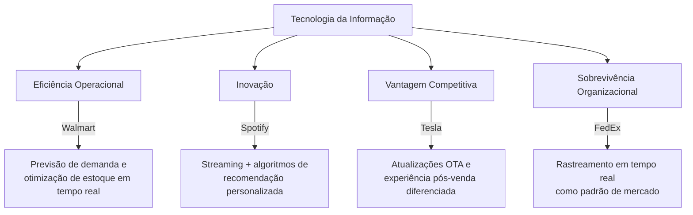
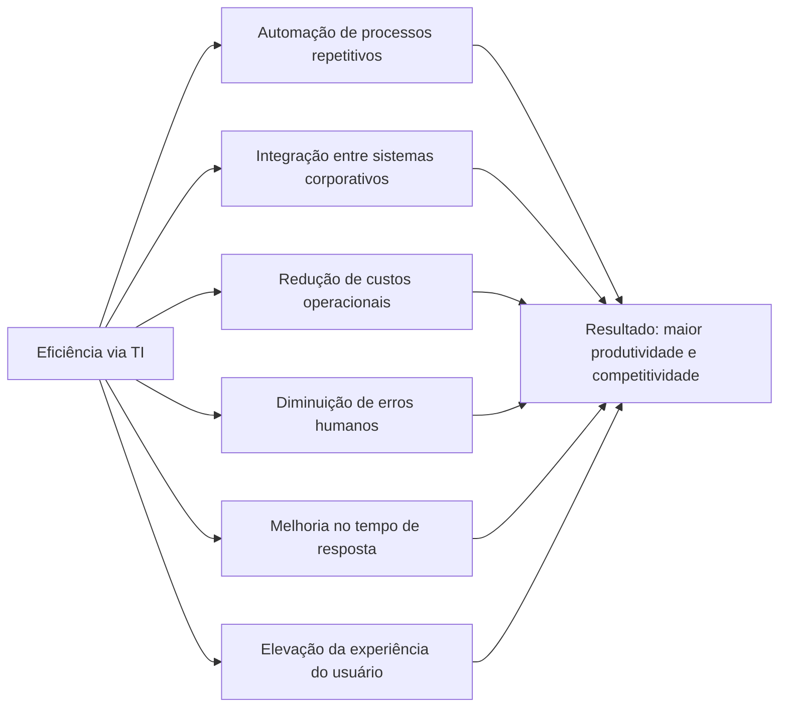
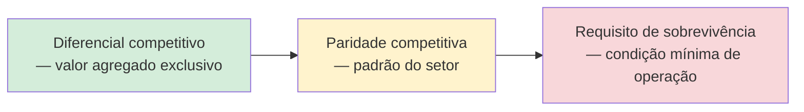

# Diagrama — Aula 03: Impacto da TI nos Negócios

## Dimensões do impacto da TI nas organizações

---

## TI como fator de eficiência: componentes

---

## Espectro de relevância estratégica da TI

