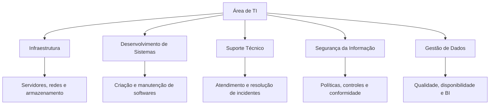
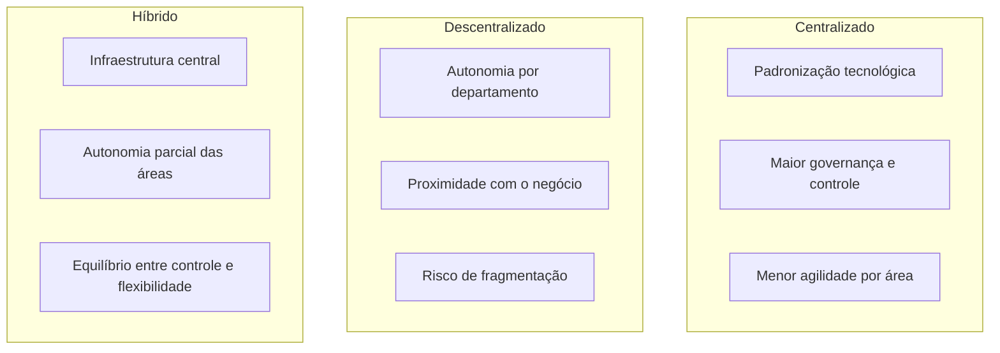
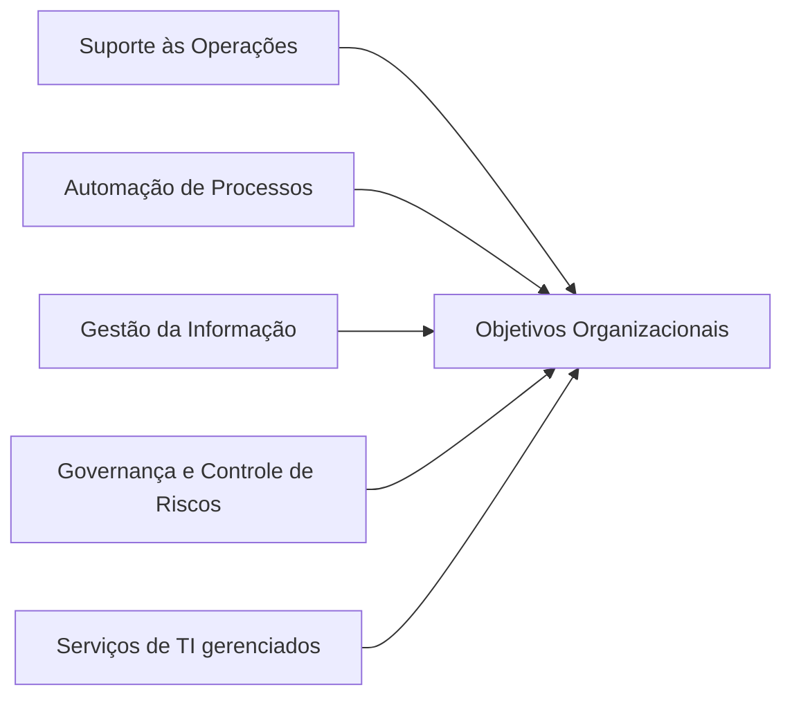
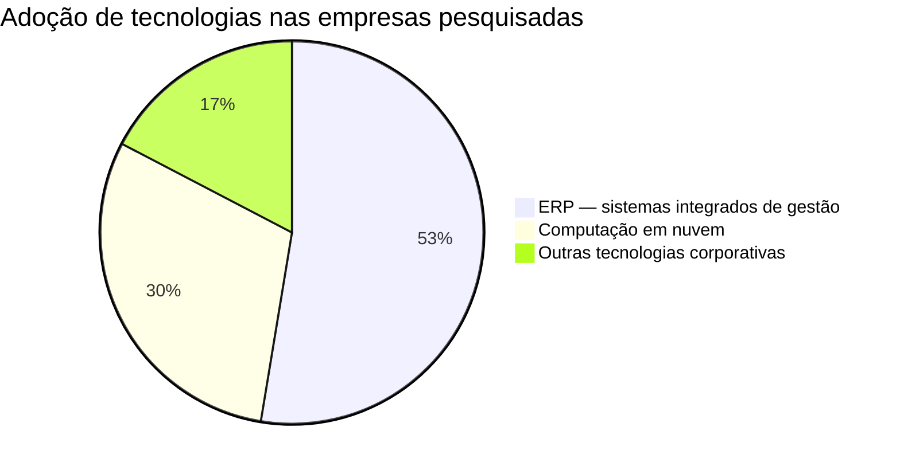

# Diagrama — Aula 04: TI nas Organizações

## Estrutura funcional da área de TI

---

## Modelos de organização da TI

---

## Funções da TI e sua relação com os objetivos organizacionais

---

## Indicadores da Pesquisa FGV (2025) — uso de TI nas empresas brasileiras

