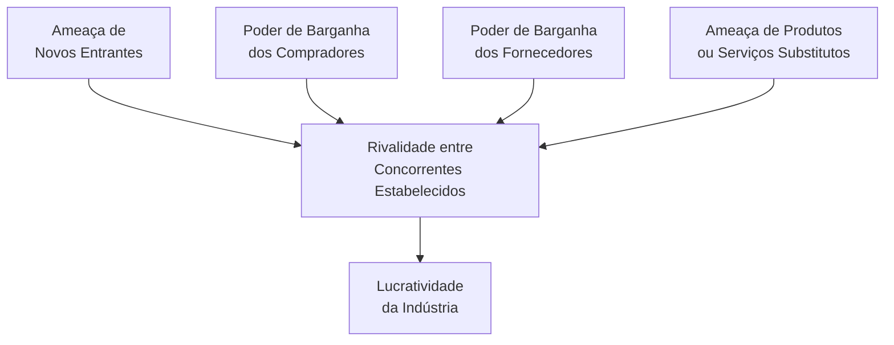
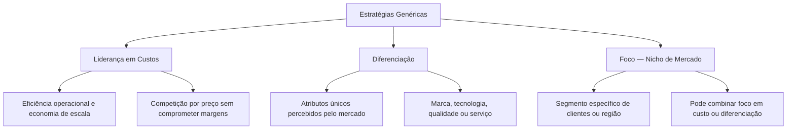
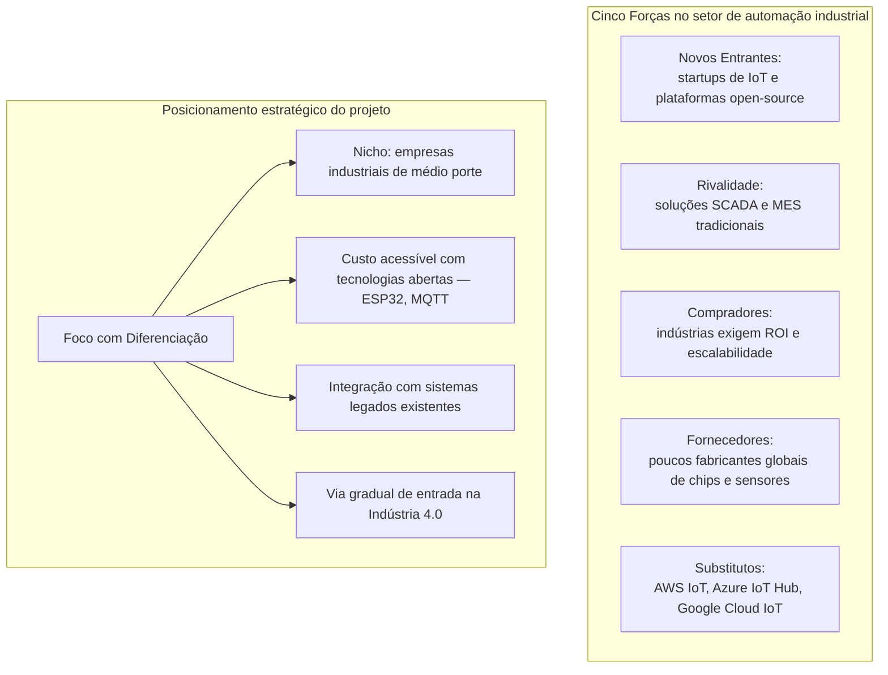

# Diagrama — Aula 05: Estratégia Competitiva (Porter, 1997)

## As Cinco Forças Competitivas de Porter

---

## Estratégias genéricas de Porter

---

## Aplicação ao Projeto Integrador — sistema de monitoramento industrial IoT

