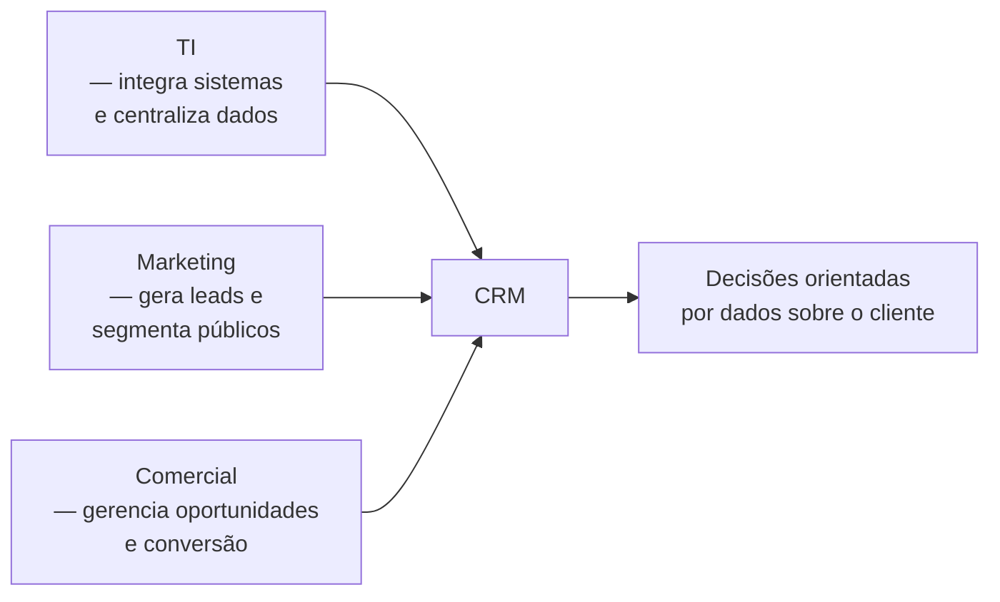
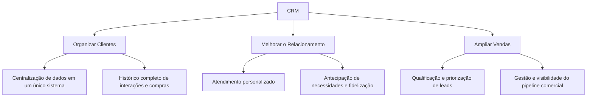
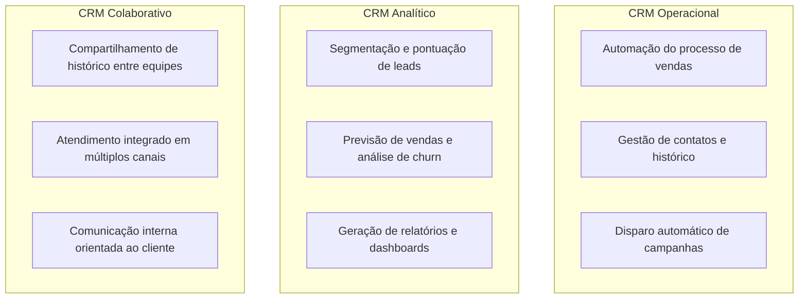
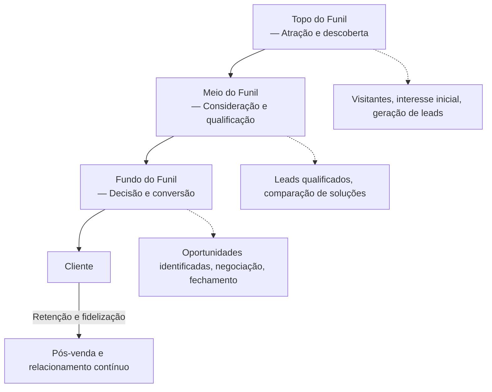

# Diagrama — Aula 06: CRM (Customer Relationship Management)

## CRM como integrador entre áreas organizacionais

---

## Objetivos estratégicos do CRM

---

## Tipos de CRM e suas funções

---

## Funil de vendas e jornada do cliente

